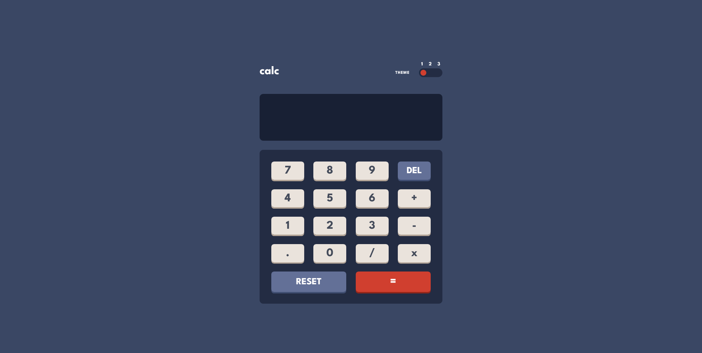

# Frontend Mentor - Calculator app solution

This is a solution to the [Calculator app challenge on Frontend Mentor](https://www.frontendmentor.io/challenges/calculator-app-9lteq5N29). Frontend Mentor challenges help you improve your coding skills by building realistic projects. 

## Table of contents

- [Overview](#overview)
  - [The challenge](#the-challenge)
  - [Screenshot](#screenshot)
  - [Links](#links)
- [My process](#my-process)
  - [Built with](#built-with)
  - [What I learned](#what-i-learned)
  - [Useful resources](#useful-resources)
- [Author](#author)

## Overview

### The challenge

Users should be able to:

- See the size of the elements adjust based on their device's screen size
- Perform mathmatical operations like addition, subtraction, multiplication, and division
- Adjust the color theme based on their preference
- **Bonus**: Have their initial theme preference checked using `prefers-color-scheme` and have any additional changes saved in the browser

### Screenshot

### Links

- Solution URL: [Github](https://github.com/johnsonjoelle/FEM-calculator-app)
- Live Site URL: [Github Pages](https://johnsonjoelle.github.io/FEM-calculator-app/)

## My process

### Built with

- Semantic HTML5 markup
- CSS custom properties
- Flexbox
- CSS Grid
- Mobile-first workflow
- jQuery

### What I learned

This was my first time using sessionStorage as opposed to localStorage.

It was also interesting figuring out a way to perform calculations for a mathematical function entered by the user. I'm not sure if my solution is the most elegant, but it works well and follows the rule of BOMDAS. This was definitely a fun challenge.

### Useful resources

- [Styling Cross-Browser Compatible Range Inputs with CSS by Daniel Stern](https://css-tricks.com/styling-cross-browser-compatible-range-inputs-css/) - This is a great article which helped me understand how to do a custom style for range input elements.

## Author

- Website - [Joelle Johnson](https://joellejohnson.com)
- Frontend Mentor - [@johnsonjoelle](https://www.frontendmentor.io/profile/johnsonjoelle)
